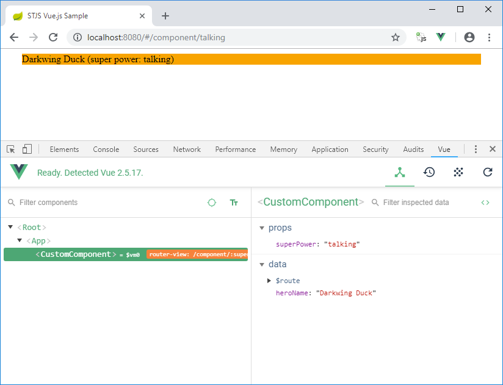
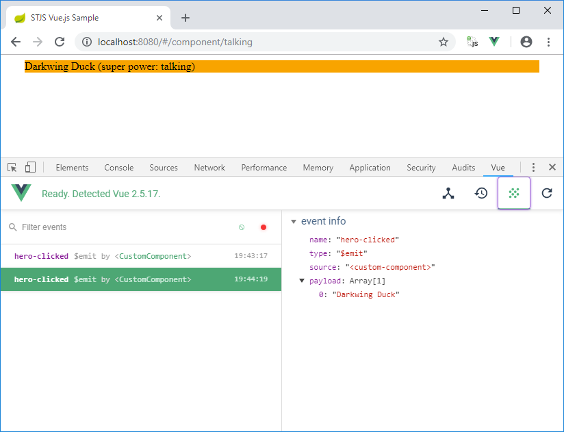

# stjs-vuejs

After reading [Goodbye webpack: Building Vue.js Applications Without webpack](https://markus.oberlehner.net/blog/goodbye-webpack-building-vue-applications-without-webpack/) and the fast success with applying the idea to my [simplistic-transpiler](https://github.com/janScheible/simplistic-transpiler) sample I remembered [ST-JS : Strongly Typed JavaScript](https://st-js.github.io/) that I liked alot in the past. It was the foundation of my [Knorxx Framework](https://github.com/janScheible/knorxx).

Vue.js sticks with simple object literals whilst stjs is classed based (pretty obvious for a Java transpiler I would say).
The class vs. object literal issue causes some [controversial discussion](https://github.com/vuejs/vue/issues/2371) within the Vue.js community.
Inspired by [Awesome Vue TS](https://github.com/HerringtonDarkholme/av-ts) and the [stjs React bridge](https://github.com/st-js/react-bridge) I gave stjs a try with Vue.js.
Awesome Vue TS provides Typescript decorators like `@Component` and `@Prop` and has an example in its readme how a decorated Typescript class is mapped to a Vue.js object literal.
The stjs React bridge on the other hand contains an example how to [hack the standard class inheritance mechanism `stjs.extend`](https://github.com/st-js/react-bridge/blob/master/src/main/js/META-INF/resources/webjars/stjs-react/stjs-react.js).
These two ideas combined resulted in a pretty nice proof of concept with Java annotations and a tailored `stjs.extend` behavior (see sample code at bottom of file).

## Installation

For running the application the following is enough:
```
mvn clean install spring-boot:run
```

## Development workflow

stjs lacks a watch mode which is standard today.
The solution was to use the [fizzed-watcher-maven-plugin](https://github.com/fizzed/maven-plugins) for triggering transpilation after changing Java source files.
This works pretty good together with e.g. Netbeans's incremental compilation because the stjs-maven-plugin uses incremental transpilation per default.

Starting the watch mode:
```
mvn fizzed-watcher:run
```

## Summary

The example combines good old stjs with Vue.js 2.5 and Vue Router 3.0.
Hot swap works for frontend Java code that is transpiled to JavaScript.
Shared Java classes and interfaces are providing a seamless Spring MVC REST service integration.

I don't agree 100% with [the statement about Typescript replaced the need for stjs completely](https://st-js.github.io/typescript.html) added by [Stéphane Goetz](https://github.com/onigoetz) last year to the stjs homepage.
A stjs project like this one still provides a pretty seamless development experience.
Java is used everywhere, only a Maven build is needed (no node or npm except for the production build) and the usual Java tools like Findbugs or [pocketsaw](https://github.com/janScheible/pocketsaw) still work.

Perhaps stjs would just need to catch up with current JavaScript a bit.
I prototyped for example the usage of es6 modules, es6 classes and arrow functions in my [simplistic-transpiler](https://github.com/janScheible/simplistic-transpiler).
The resulting JavaScript is so much closer to the Java code.

Equipped with a lot of free time I would combine the thin compatibility layer in `stjs.js`, the bridge concept, the modular code structure (Maven projects as well as for example the `WriterContributor` concept) and the source maps of stjs with the es6 usage, support of GWT's `@JsInterop` and the dev server experience of the simplistic-transpiler.
The code would work out of the box in modern browsers like Chrome.
For support of older browser e.g. Bable could be used.
The result would be IMHO pretty awesome. :-)

# Sample Web application

The sample Web application is a standard Vue.js application.

The first screenshot shows component view of the Vue.js Devtools.


In the second screenshot the emitted events are shown.


# Vue.js Component

The Java class
```java
package com.scheible.stjs.vuejs.application.client.component;

@Component(
	name = "custom-component",
	template = ""
			+ "<div style=\"background-color: orange; font-family: Times, serif;\" v-on:click=\"onClick\">"
			+ "    <span>{{heroName}}</span> <span>(super power: {{superPower}})</span>"
			+ "</div>"
)
public class CustomComponent extends VueComponent {
	
	String heroName = "loading...";
	
	@Prop
	String superPower;
	
	@Override
	public void created() {
		RestClientFactory.get(TestRestService.class).getResult()
				.then((status, body) -> heroName = body.getName());
	}
	
	void onClick() {
		$emit("hero-clicked", heroName);
		alert("You clicked the hero '" + heroName + "'!");
	}	
}
```
is transformed to the following Vue.js component object literal
```js
{
  name: "custom-component",
  template: "<div style=\"background-color: orange; font-family: Times, serif;\" v-on:click=\"onClick\">    <span>{{heroName}}</span> <span>(super power: {{superPower}})</span></div>",
  data: function() {
    return {
      "heroName": "loading..."
    };
  }
  "props":["superPower"],
  "created": function() {
    RestClientFactory.get(TestRestService).getResult().then(stjs.bind(this, function(status, body) {
      return this.heroName = body.getName();
    }));
  },
  "methods":{
    onClick: function() {
      this.$emit("hero-clicked", this.heroName);
      alert("You clicked the hero '" + this.heroName + "'!");
    };
   }
}
```
that make for example data, props and event emitting work with an class instance view of the world.

# Spring MVC integration 

The `RestClientFactory.get(TestRestService)` invocation in the `created` method creates a dynamic REST client that uses the shared annotated service interface.

```java
package com.scheible.stjs.vuejs.application.shared;

public interface TestRestService extends RestService {
	
	@GetMapping("/get-result")
	RestResult<ResultDto> getResult();
}
```

The `ResultDto` class is also a shared class.
The result are strongly-typed services.